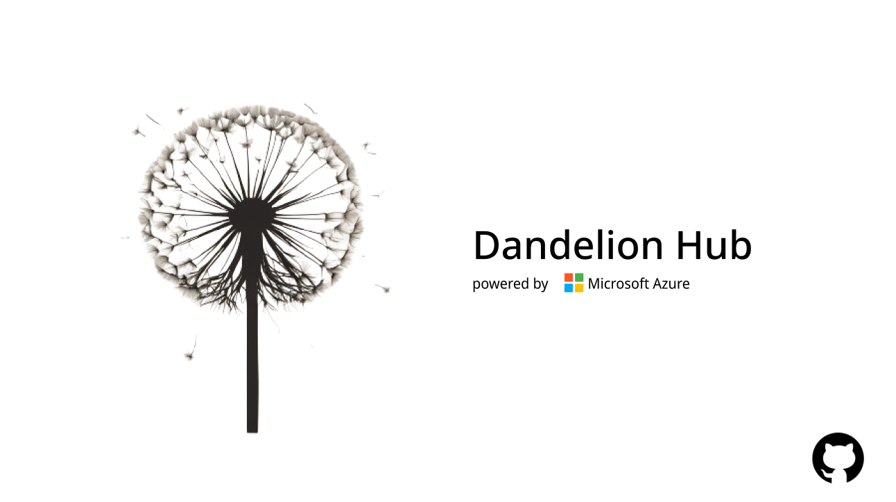
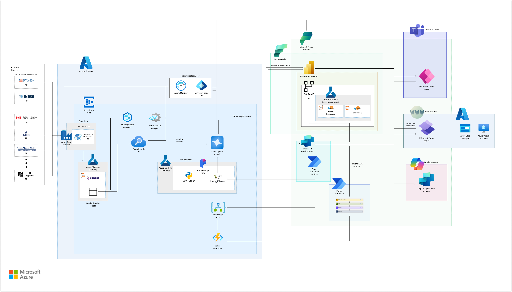

# Dandelion Hub 🌼 ([Spanish Version](README-es.md))

This solution was developed for the 'Hack for Cross Agency Knowledge Management' executive challenge of the 'Innovation Challenge' hackathon organized by Microsoft.

"Dandelion Hub" (DH) is a revolutionary data management platform designed to foster collaboration and knowledge sharing among government agencies. 🏦

Inspired by the life cycle of a dandelion, our platform transforms diverse data sources into insightful reports and visualizations, much like a dandelion transforms water into a beautiful bloom that can reproduce trought the air. 🍃

With Dandelion Hub, government agencies can harness the power of data to make informed decisions, drive innovation, and ultimately improve the lives of citizens, works as a bridge between countries using technology as the link.

Our platform enables seamless data integration, advanced analytics, and secure information sharing, empowering agencies to flourish and spread their knowledge like dandelion seeds in the wind. Letting everyone to reach data from everywhere in one platform. 🗺️

> Cultivating Knowledge 🌱, Harvesting Insights 🌾

## Architecture

This project uses various Microsoft Azure tools and services to collect, process, analyze, and visualize data from multiple governmental sources. The following diagram presents the solution architecture.

### Components

1. **Azure Data Factory**: Collects data from various governmental sources through a pipeline that consumes APIs, ensuring continuous, automated, and scalable data ingestion.

2. **Azure Cosmos DB**: The collected data is stored in Azure Cosmos DB, a NoSQL database, which allows for quick and flexible access to information.

3. **Azure Machine Learning**: Machine learning models in Azure Machine Learning are used to process and standardize the data. The techniques applied include:

   - Linear Regression
   - Clustering

4. **Azure Prompt Flow**: Implements checks when the information provided by users differs from the data stored in our verified sources.

5. **Azure Blob Storage**: The processed data and intermediate results are stored in Azure Blob Storage, which efficiently handles large volumes of data.

6. **Azure OpenAI Service**: Deploys advanced artificial intelligence models to generate insights and respond to user queries.

7. **Azure Search**: Facilitates efficient search and retrieval of processed data, allowing users to find the necessary information quickly and effectively.

8. **Microsoft Power BI Embedded**: Provides advanced data visualization capabilities that integrate directly into our website, offering an interactive and visually appealing experience.

9. **Microsoft Copilot Studio**: Allows users to interact with the data through a chatbot, generating automated charts and visual reports to facilitate understanding and analysis of information.

### Data Flow

1. **Data Ingestion**: Azure Data Factory collects data from various governmental APIs.

2. **Storage**: The data is stored in Azure Cosmos DB.

3. **Processing**: Azure Machine Learning standardizes the data and can also apply linear regression and clustering techniques.

4. **Intermediate Storage**: The processing results are stored in Azure Blob Storage.

5. **Advanced Analysis**: Azure OpenAI Service generates additional insights from the processed data.

6. **Search**: Azure Search enables efficient retrieval of the data.

7. **Visualization**: Through Power BI Embedded, integrated visualizations are provided on the website.

8. **Interaction**: Three options are offered for interaction:

   - Microsoft Teams: Through an integration based on Microsoft Power Apps, users can interact with the chatbot via Teams.
   - Web Version: Users can access the platform through a web application.
     - This web version utilizes Microsoft Power Pages, Azure Blob Storage, and Azure Virtual Machine for deployment.
   - Copilot Version: Users can interact with the chatbot via Copilot Studio.

9. **Data Validation**: Through Azure Prompt Flow, checks and notifications are implemented to ensure the fidelity of the data entered by users.
